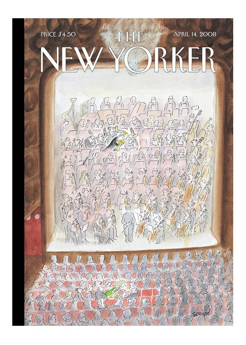
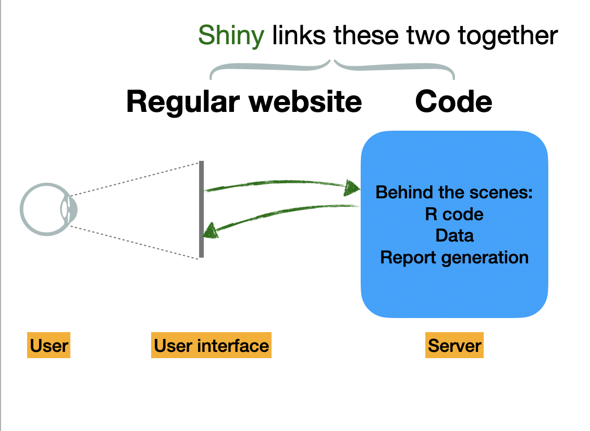
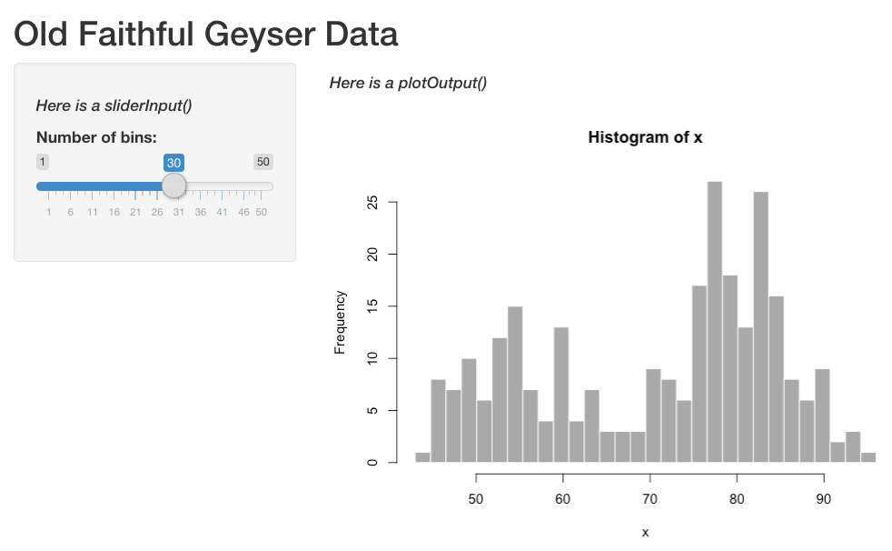

class: center, middle

# Hello! 


---

class: center, middle


---

# Marine science is like an orchestra

Each musician has areas where they’re very specialized, and areas where they are clueless

--

What we do is a combination of highly technical skilled work and more whimsical multitasking/communicating

--

But we’re all working together to try to make a big, beautiful thing happen

---

class: center, middle


---

class: center, middle


---
# How we deal with complexity in an orchestra setting: 

### Clean it up

### Use building blocks

### Streamline our communications

### People are the special ingredient

## This is the same in marine science! And Shiny can help us with many of these tasks.


---

class: center, middle

Shiny can be a little gnarly at first.


---

# Outline

1. `shiny` basics - when to use it, how to do it

--

2. Working with data in Shiny apps

  User uploads & downloads
  
  Connecting to a database using `{DBI}` and `{pool}`
  
  Markdown reports
  
--

3. Lessons I learned from developing "mmBIET"

--

If you'd like to follow along, clone this directory and follow the examples!
[https://github.com/MargaretSiple-NOAA/shinyoverview](https://github.com/MargaretSiple-NOAA/shinyoverview)

--

Available in the repo but optional for today:

> 4. *Translating your Shiny apps using `{shiny.18n}`*

> 5. *Using Shiny to supercharge your remote teaching with `{learnr}`*


---

# Why I learned Shiny

.pull-left[

.caption[
**Image:** Jeff Moore
]
]

.pull-right[

]

---

# What is Shiny?



---

# When is Shiny useful?

When we want to make R code accessible outside of an R or RStudio environment. For example,

--

- teaching a package

--

- showing data visualizations to non-experts

--

- streamlining certain code-intensive things (like database queries or visualizing bulky simulation outputs)

---

# Starting a new Shiny app

Install **shiny**:

```{r eval=FALSE, tidy=FALSE}
install.packages("shiny")
```

From The RStudio IDE, pick `New File -> Shiny Web App`

You can choose between single (**app.R**) or multiple files (**ui.R** and **server.R**)

*Does it matter which one you choose?*
>Not really. Some people like the organization of having multiple files. But it really doesn't make a difference!

---

# Each Shiny app has two components

The **user interface (`ui`)** object dictates the appearance of the app. UI functions write HTML. For something to appear in your app, it needs to be in the UI.

***

The **`server()` function** contains rendering expressions that create the objects to display. 


The server function and UI object are passed to the `shinyApp()` function to create a Shiny app object.

---

# **ui.R**/server.R

.pull-left[
The ui looks like this:

```{r eval=FALSE}
ui <- fluidPage(
    titlePanel("Old Faithful Geyser Data"),
    sidebarLayout(
        sidebarPanel(
*            sliderInput("bins",
                        "Number of bins:",
                        min = 1,
                        max = 50,
                        value = 30)),
        mainPanel(
*           plotOutput("distPlot"))
    )
)
```
]

.pull-right[
The corresponding ui looks like this:


]

---

# **ui.R**/server.R

The ui code contains the following information: 

1. The UI type 
  - `fluidPage()` puts elements in rows that can include columns `r emo::ji("cake")`
  - `navbarPage()` has a navigation bar `r emo::ji("file")`

2. Layout elements (`sidebarLayout()` etc.)

3. Theme information (e.g., `{shinythemes}`)

--

4. Output objects (`plotOutput()`, etc.)

5. Input objects (`sliderInput()`,`fileInput()` etc.)

*Input objects link the user interface to the R code on the server.*

---

# ui.R/**server.R**

The server builds a list-like object called `output`. The contents of `output` are displayed in the ui.

```{r eval= FALSE}
server <- function(input, output) {
    output$distPlot <- renderPlot({
        # generate bins based on input$bins from ui.R
        x    <- faithful[, 2]
        bins <- seq(min(x), max(x), length.out = input$bins + 1)
        # draw the histogram with the specified number of bins
        hist(x, breaks = bins, col = 'darkgray', border = 'white')
    })
}
```

---

# **ui.R**/**server.R**

The server builds a list-like object called `output`. `output` objects are displayed in the ui. Here is how they are linked:

.pull-left[
```{r eval= FALSE}
server <- function(input, output) {
*    output$distPlot <- renderPlot({
        # generate bins based on input$bins from ui.R
        x    <- faithful[, 2]
        bins <- seq(min(x), max(x), length.out = input$bins + 1)
        # draw the histogram with the specified number of bins
        hist(x, breaks = bins, col = 'darkgray', border = 'white')
    })
}
```
]

.pull-right[
```{r eval=FALSE}
ui <- fluidPage(
    titlePanel("Old Faithful Geyser Data"),
    sidebarLayout(
        sidebarPanel(
            sliderInput("bins",
                        "Number of bins:",
                        min = 1,
                        max = 50,
                        value = 30)),
        mainPanel(
*           plotOutput("distPlot"))
    )
)
```
]
---

# What's on the server?

R code... mostly :)

--


---

# ui.R/**server.R**

- **Rendering functions** (`renderPlot()`, `renderTable()`, etc.)
  - Build a new object to display every time the inputs change

--

- **Reactive expressions**
  - `reactive()` caches reactive objects so you can access them later in the server logic -- very important!
  - `eventReactive()` creates reactive objects but only when a specific input changes (e.g., a "Run Analysis!" button is clicked)

--

- **Observe expressions** change the ui based on input, e.g.,
  - autopopulate default values in a form if a user has selected a default
  - change the range for one input based on another input

---

class: center, middle

# 01_basics/app.R

---

class: center, middle, inverse

# Getting data into and out of Shiny


---


# Get data into a Shiny app

Shiny can accept data from various file types. 

You can get data into Shiny from:
- a file the user uploads
- a database
- a persistent file packaged with your app

---

# User uploads data
If you want to design your app so that people can bring in their own data:

Add a file upload input in the UI using the function `fileInput()`. In the `server` function, access the uploaded files via `input$mydata`:
```{r eval=FALSE}
ui <- fluidPage(
  titlePanel("Uploading Files"),
  sidebarLayout(
    sidebarPanel(
      # refer to input$mydata in the server code to reference this object:
      fileInput("mydata", "Choose CSV File",
                multiple = FALSE,
                accept = c("text/csv",
                         "text/comma-separated-values,text/plain",
                         ".csv")),
```

---

# Connect to a database

Shiny can access databases through the interface using the `{DBI}` and `{pool}` packages. 

```{r eval=FALSE}
library(shiny)
library(DBI)

ui <- fluidPage(
  numericInput("nrows", "Enter the number of rows to display:", 5),
  tableOutput("tbl")
)

server <- function(input, output, session) {
  output$tbl <- renderTable({
*    conn <- dbConnect(
*      drv = RMySQL::MySQL(),
*      dbname = "shinydemo",
*      host = "shiny-demo.csa7qlmguqrf.us-east-1.rds.amazonaws.com",
*      username = "guest",
*      password = "guest")
    on.exit(dbDisconnect(conn), add = TRUE)
    dbGetQuery(conn, paste0(
      "SELECT * FROM City LIMIT ", input$nrows, ";"))
  })
}

shinyApp(ui, server)
```

---

# Put the data on the server

You can publish small data files that sit on the server with your app. You can load these data at the top of the app file (if server and ui are both located in **app.R**) or in the **ui.R** file if you're using separate files for ui and server.  

---

# Downloading from Shiny

You can download data from a Shiny app using `downloadLink()` in the ui and `downloadHandler()` in the server:

```{r eval=FALSE}
ui <- fluidPage(
  downloadLink("downloadData", "Download")
)

server <- function(input, output) {
  # Our dataset
  data <- mtcars

  output$downloadData <- downloadHandler(
    filename = function() {
      paste("data-", Sys.Date(), ".csv", sep="")
    },
    content = function(file) {
      write.csv(data, file)
    }
  )
}
```

---

# Downloading from Shiny

- Download **CSV or txt files** from Shiny apps

--

- Generate reports in Markdown that are knitted to **html** (details on how to do that [here](https://shiny.rstudio.com/articles/generating-reports.html))

--

- You can also download **images** that have been generated in the app (e.g., download plots from the app)


---

# Downloading HTML files from Shiny

An HTML report consists of two pieces:

--

1) A `report.Rmd` template file with a yaml header specifying the objects passed from Shiny

```{yaml eval=FALSE}
---
title: "My Shiny app: the report"
output: html_document
params:
  obj_to_pass1: NA
  obj_to_pass2: NA
---
```
--

2) An object `output$report` in the server logic

```{r eval=FALSE}
output$report <- downloadHandler(
    filename = "report.html",
    content = function(file) {
      tempReport <- file.path(tempdir(), "report.Rmd")
      file.copy("report.Rmd", tempReport, overwrite = TRUE)
*      params <- list(obj_to_pass1, obj_to_pass2)
            rmarkdown::render(tempReport, output_file = file,
                        params = params,
                        envir = new.env(parent = globalenv()))
```


---

# More resources for dealing with data in Shiny

Dean Attali's [Persistent Data Storage With Shiny](https://daattali.com/shiny/persistent-data-storage/) app 

[This](https://shiny.rstudio.com/articles/persistent-data-storage.html) blog post about data storage in Shiny (also by Dean Attali)

RStudio's [best practices for dashboards](https://db.rstudio.com/best-practices/dashboards/) shows how to connect to databases in Shiny

---

class: center, middle, inverse

# 02_dataindataout/explore_ram/ui.R

---

class: center, middle

# Lessons I learned from developing a Shiny app


---

# UI is very important

Designing a good ui is hard! And Shiny defaults are not the most intuitive / appealing / accessible version they can be.

--

If you are designing an app for management, a good ui is essential.

--

- my #1 tip: if you have time, pilot test with subject matter experts AND users
  
--

- check accessibility using the app's URL using the [Web Accessibility Evaluation (WAVE) Tool](https://wave.webaim.org/)

--

- use UX resources if they are available!

--
  
- if your institution doesn't have UX resources, design pilot testing so that you get helpful feedback on UX:
  - [18F Methods](https://methods.18f.gov/validate/) and [Maze](https://maze.design/guides/usability-testing/questions/) have great lists of testing questions and methods
  - 18F Methods also has an [example agreement](https://methods.18f.gov/participant-agreement/) for testers
  - Depending on the final format, places like  [UsabilityHub](https://usabilityhub.com/) have interfaces that will provide data on clicks and scrolling behavior when testing is remote
  

---

# You can publish Shiny apps!

If you've put a lot of time into making a Shiny app, you should get credit! 
The publication/credit avenues are unconventional for Shiny apps, but they DO exist.

- Publish in an open source software journal (e.g., JOSS)
- Publish code straight from GitHub with a DOI from Zenodo
- (for "just for fun" apps): submit your Shiny app to the RStudio [Shiny contest](https://community.rstudio.com/t/shiny-contest-2020-is-here/51002)
<!-- see if you can get some data on citation rates for JOSS vs zenodo github entry -->

---

# Having fun is good

class: center, middle


---

.pull-left[

]

---

class: center, middle

# Fin!

### contact

`r icon::fa("envelope")`: mcsiple@gmail.com
`r icon::fa("twitter")`: @margaretsiple

### **More Shiny resources:**
We love a [cheatsheet](https://shiny.rstudio.com/images/shiny-cheatsheet.pdf)

### Check out my Shiny apps!

The [Marine Mammal Bycatch Impacts Exploration Tool](https://msiple.shinyapps.io/mammaltool/)

[Novel-gazing](https://msiple.shinyapps.io/NovelGazingApp/) (for Goodreads users) 

[Adopt Don't Shop](https://nsilbiger.shinyapps.io/AdoptDontShop/) (collaboration with Nyssa Silbiger)

***

Slides created using the R package [**xaringan**](https://github.com/yihui/xaringan).
