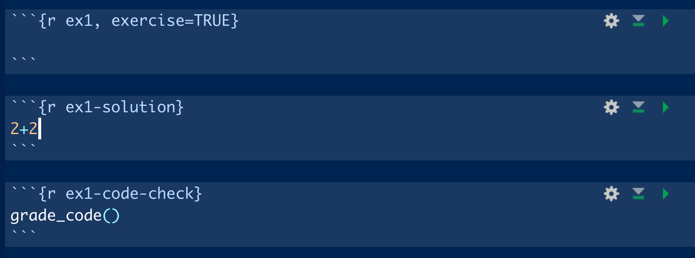

class: center, middle

# 1 - What is Shiny? 


---

# Insert orchestra slides here

---

# When should I use Shiny?

When we want to make R code accessible outside of an R or RStudio environment. For example,

--

- teaching a package

--

- showing data visualizations to non-experts

--

- streamlining certain code-intensive things (like database queries or visualizing outputs from an analysis)


---

# What *is* Shiny, anyway?


---

# Installing Shiny

Install **shiny**:

```{r eval=FALSE, tidy=FALSE}
install.packages("shiny")
```

---

# Starting a new Shiny app

From The RStudio IDE, pick New File --> Shiny Web App

You can choose between single (**app.R**) or multiple files (**ui.R** and **server.R**)

*Does it matter which one you choose?*
>Not really. Some people like the organization of having multiple files. But it really doesn't make a difference!

---

# Shiny structure: user interface (ui) and server

### Each Shiny app has two components:

The **user interface (`ui`)** object dictates the appearance of the app. Functions in the ui write HTML for the website. 

The **`server()` function** contains rendering expressions that create the objects to display. 

The server function and ui object are passed to the `shinyApp()` function to create a Shiny app object.

---

# **ui.R**/server.R

The ui looks like this:

```{r eval=FALSE}
ui <- fluidPage(
    titlePanel("Old Faithful Geyser Data"),
    sidebarLayout(
        sidebarPanel(
            sliderInput("bins",
                        "Number of bins:",
                        min = 1,
                        max = 50,
                        value = 30)
        ),
        mainPanel(
           plotOutput("distPlot")
        )
    )
)
```

---

# **ui.R**/server.R

1. The UI type 
  - `fluidPage()` puts elements in rows that can include columns `r emo::ji("cake")`
  - `navbarPage()` has a navigation bar `r emo::ji("file")`

2. Layout elements (`sidebarLayout()`, `splitLayout()`, `verticalLayout()` etc)

3. Theme information (e.g., bootstrap themes from `{shinythemes}`)

---

# **ui.R**/server.R

3. Output objects (`renderImage()`, `renderPlot()`, `renderTable()`)

4. Input objects (`sliderInput()`, `numericInput()`, `fileInput()`) (sometimes called 'widgets')

*These are what link the user interface to the R code on the server.*

---

# ui.R/**server.R**

The server builds a list-like object called `output` that contains all the code needed to produce the contents of your app.

```{r eval= FALSE}
server <- function(input, output) {
    output$distPlot <- renderPlot({
        # generate bins based on input$bins from ui.R
        x    <- faithful[, 2]
        bins <- seq(min(x), max(x), length.out = input$bins + 1)
        # draw the histogram with the specified number of bins
        hist(x, breaks = bins, col = 'darkgray', border = 'white')
    })
}
```

---

# ui.R/**server.R**

- **Rendering functions** (`renderImage()`, `renderPlot()`, `renderTable()`)
  - Build a new object to display every time the inputs change

--

- **Reactive expressions**
  - `reactive()` caches reactive objects so you can access them later in the server logic -- very important!
  - `eventReactive()` creates reactive objects but only if a specific input changes (e.g., a "Run Analysis!" button)

--

- **Observe expressions** - only change the value of a result
  - Changes the ui based on input, e.g.,
    - autopopulate default values in a form if a user has selected a default
    - change the range for one input based on another input

---

class: center, middle

# 01_basics/app.R

---

class: center, middle, inverse

# Getting data into and out of Shiny


---


# Get data into a Shiny app

Shiny can accept data from various file types. 

You can get data into Shiny from:
- a file the user uploads
- a database
- a persistent file packaged with your app

---

# User uploads data
If you want to design your app so that people can bring in their own data:

Add a file upload input in the UI using the function `fileInput()`. In the `server` function, access the uploaded files via `input$mydata`:
```{r eval=FALSE}
ui <- fluidPage(
  # App title ----
  titlePanel("Uploading Files"),
  sidebarLayout(
    sidebarPanel(
      fileInput("mydata", "Choose CSV File",
                multiple = FALSE,
                accept = c("text/csv",
                         "text/comma-separated-values,text/plain",
                         ".csv")),
```

---

# Connect to a database

Shiny can access databases through the interface using the `{DBI}` and `{pool}` packages. 

```{r eval=FALSE}
library(shiny)
library(DBI)

ui <- fluidPage(
  numericInput("nrows", "Enter the number of rows to display:", 5),
  tableOutput("tbl")
)

server <- function(input, output, session) {
  output$tbl <- renderTable({
*    conn <- dbConnect(
*      drv = RMySQL::MySQL(),
*      dbname = "shinydemo",
*      host = "shiny-demo.csa7qlmguqrf.us-east-1.rds.amazonaws.com",
*      username = "guest",
*      password = "guest")
    on.exit(dbDisconnect(conn), add = TRUE)
    dbGetQuery(conn, paste0(
      "SELECT * FROM City LIMIT ", input$nrows, ";"))
  })
}

shinyApp(ui, server)
```

---

# Put the data on the server

You can publish small data files that sit on the server with your app. You can load these data at the top of the app file (if server and ui are both located in **app.R**) or in the **ui.R** file if you're using separate files for ui and server.  

---

# Data in/out resources for Shiny

RStudio's [best practices for dashboards](https://db.rstudio.com/best-practices/dashboards/) shows how to connect to databases in Shiny

---

# Downloading from Shiny

You can download data from a Shiny app using `downloadLink()` in the ui and `downloadHandler()` in the server:

```{r eval=FALSE}
ui <- fluidPage(
  downloadLink("downloadData", "Download")
)

server <- function(input, output) {
  # Our dataset
  data <- mtcars

  output$downloadData <- downloadHandler(
    filename = function() {
      paste("data-", Sys.Date(), ".csv", sep="")
    },
    content = function(file) {
      write.csv(data, file)
    }
  )
}
```

---

# Downloading from Shiny

- Download **CSV or txt files** from Shiny apps

--

- Generate reports in Markdown that are knitted to **html** (details on how to do that [here](https://shiny.rstudio.com/articles/generating-reports.html))

--

- You can also download **images** that have been generated in the app (e.g., download plots from the app)


---

# Downloading HTML files from Shiny

This is really helpful if you want to generate a report or a certificate.

--

An HTML report consists of two pieces:

--

1) A `report.Rmd` file with a yaml header providing the objects generated in the app that should be passed to the report

--

2) An object `output$report` in the server logic 

```{r eval=FALSE}
output$report <- downloadHandler(
    filename = "report.html",
    content = function(file) {
      tempReport <- file.path(tempdir(), "report.Rmd")
      file.copy("report.Rmd", tempReport, overwrite = TRUE)
*      params <- list(obj_to_pass1, obj_to_pass2)
            rmarkdown::render(tempReport, output_file = file,
                        params = params,
                        envir = new.env(parent = globalenv()))
```


---

# More resources for dealing with data in Shiny

Dean Attali's [Persistent Data Storage With Shiny](https://daattali.com/shiny/persistent-data-storage/) app 

[This](https://shiny.rstudio.com/articles/persistent-data-storage.html) blog post about data storage in Shiny (also by Dean Attali)

---

class: center, middle, inverse

# 02_dataindataout/explore_ram/ui.R

---

class: center, middle

# Improving Shiny app accessibility

---

# Shiny apps for all

Designing a good ui is hard! And Shiny defaults are not the most intuitive / appealing / accessible version they can be.

--

If you are designing an app for management, a good ui is essential.

--

- my #1 tip: if you have time, pilot test with subject matter experts AND users
  
--

- check accessibility using the app's URL using the [Web Accessibility Evaluation (WAVE) Tool](https://wave.webaim.org/)

--

- use UX resources if they are available!

--
  
- if your institution doesn't have UX resources, design pilot testing so that you get helpful feedback on UX:
  - [18F Methods](https://methods.18f.gov/validate/) and [Maze](https://maze.design/guides/usability-testing/questions/) have great lists of testing questions and methods
  - 18F Methods also has an [example agreement](https://methods.18f.gov/participant-agreement/) for testers
  - Depending on the final format, places like  [UsabilityHub](https://usabilityhub.com/) have interfaces that will provide data on clicks and scrolling behavior when testing is remote
  

---

# Translating your Shiny app

For wider utility, you can translate your Shiny app into other languages.

--

`{shiny.i18n}` (from [Appsilon](https://appsilon.com/internationalization-of-shiny-apps-i18n/) ) provides translation for shiny apps

--

```{r eval=FALSE}
devtools::install_github("Appsilon/shiny.i18n")

library(shiny)
library(shiny.i18n)

* i18n <- Translator$new(translation_json_path = "translations/translation.json")
```

---

# Translating your shiny app

You can provide either a .json file with all the translations, or a CSV with a column for each language.

--

The `i18n$t()` wrapper indicates text to be translated, e.g.:

```{r eval = FALSE}
sliderInput("bins",
*            i18n$t("Number of bins:"), # translation wrapper
            min = 1,
            max = 50,
            value = 30)

```

---

class: center, middle
# Supercharge your remote teaching using Shiny tools: `learnr`

---

# Using `learnr`
`{learnr}` uses `runtime: shiny_prerendered` to turn Markdown files into live tutorials. 

--

This is great for writing code in a 'controlled environment'
when you're:
- teaching coding concepts remotely
- demonstrating how a specific package is used
- any situation where you want to remotely set up the environment

---

# Getting started with `learnr`
```{r eval= FALSE}
install.packages("learnr")
library(learnr)
```

To make a new tutorial from the RStudio IDE, go to New File --> R Markdown --> From Template --> Interactive Tutorial {learnr}

---

# `learnr` tutorials - 1
A learnr tutorial is an .Rmd script a few additional features:

1. The output is a `learnr::tutorial`

2. The runtime (in yaml header) is `shiny_prerendered` 

3. There is some `learnr`-related setup code

4. There are `knitr` chunks which have custom options such as `exercise` and `solution`

 (from Nischal Shrestha's, great blog post [Learning learnr](https://education.rstudio.com/blog/2020/07/learning-learnr/) )
---

# `learnr` tutorials - 2
You load the packages that people will need for the tutorial in the `setup` code chunk. 

```{r eval=FALSE}
library(tidyverse)
library(palmerpenguins) #load any packages here that you want to be part of the environment for everyone using the tutorial
library(learnr)

knitr::opts_chunk$set(echo = FALSE)
```

---
# `learnr` tutorials - 3
The `exercise = TRUE` code chunks in a `learnr` document contain exercises, hints, and solutions.


---

# More `learnr` resources

Allison Horst's [post about learnr](https://education.rstudio.com/blog/2020/05/learnr-for-remote/) on RStudio Education

Angela Li's [post on publishing learnr tutorials](https://cran.r-project.org/web/packages/learnr/vignettes/shinyapps-publishing.html)

Desirée de Leon's [post on putting learnr tutorials in a package](https://education.rstudio.com/blog/2020/09/delivering-learnr-tutorials-in-a-package/)

---
class: center, middle, inverse

# 04_learnr/learnr_basics.Rmd

---

# Publishing your Shiny app

If you've put a lot of time into making a Shiny app, you should get credit! 
The publication/credit avenues are unconventional for Shiny apps, but they DO exist.

- Publish in an open source software journal (e.g., JOSS)
- Publish code straight from GitHub with a DOI from Zenodo
- (for "just for fun" apps): submit your Shiny app to the RStudio [Shiny contest](https://community.rstudio.com/t/shiny-contest-2020-is-here/51002)
<!-- see if you can get some data on citation rates for JOSS vs zenodo github entry -->

---

# What if I am a NOAA employee?

If you are building a tool for NOAA purposes, you should:

1. Host it on your NOAA GitHub account if it's a NOAA project. If not, host on your personal account and fork a copy to the NOAA account if necessary
2. Ensure good software design practices, including having documentation related to the code as well as a separate users guide
3.Structure your R code and folders consistent with a accepted best practices
4. Get a code review (this should ideally be someone who also can review the content, if there is a model in your `server.R`)
5. Include testing (and examples if it makes sense-- if it's only a shiny app and not a whole package, it may not be needed). Use a package like `testthat`.  You can also use github actions to automate this in your repository

*Modified from Corinne Bassin's recommendations to me*

---

class: center, middle

# Fin!

### contact

`r icon::fa("envelope")`: mcsiple@gmail.com
`r icon::fa("twitter")`: @margaretsiple

### **More Shiny resources:**
We love a [cheatsheet](https://shiny.rstudio.com/images/shiny-cheatsheet.pdf)

### Check out my Shiny apps!

The [Marine Mammal Bycatch Impacts Exploration Tool](https://msiple.shinyapps.io/mammaltool/)

[Novel-gazing](https://msiple.shinyapps.io/NovelGazingApp/) (for Goodreads users) 

[Adopt Don't Shop](https://nsilbiger.shinyapps.io/AdoptDontShop/) (collaboration with Nyssa Silbiger)

***

Slides created using the R package [**xaringan**](https://github.com/yihui/xaringan).
